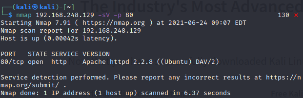
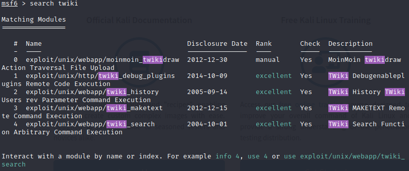
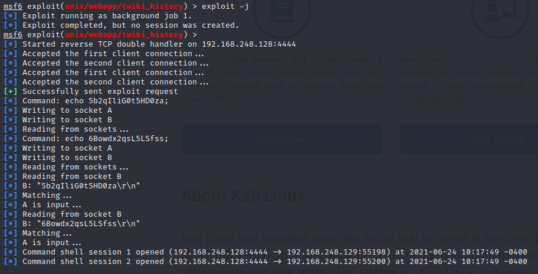
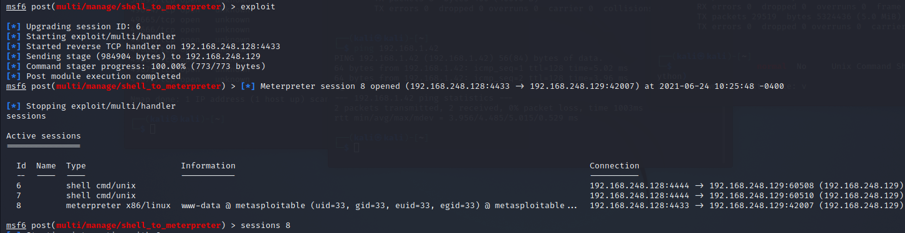
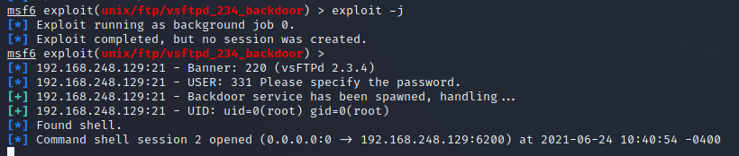
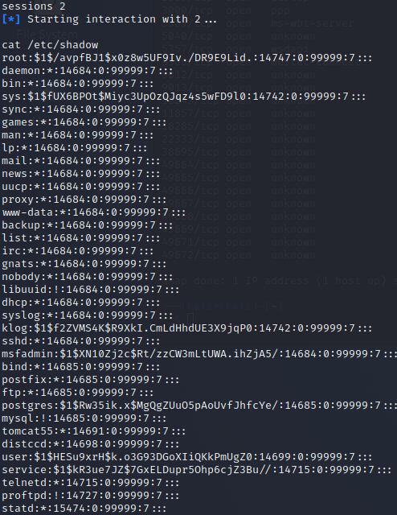
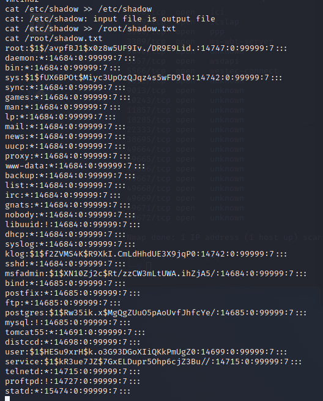
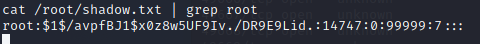
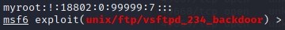

# Partie 1

## Etape 1 : Découverte

### Q1 : Qu’elle est le rôle de l’application ?

L'application est une plateforme web de collaboration.

### Q2 : A partir de nmap lister les ports ouverts que Metasploitable

Twiki étant un site web, c'est le service http qui permet la communication avec twiki.

### Q3 : Toujours à partir de nmap en utilisant les options qui vous permettent de déterminer le nom est la version du service ?

- a. 

        -sV 
        -p 
        -T4

- b. C'est le service Apache, en version 2.2.8 qui permet la communication http de Twiki

### Q4 Rechercher s’il existe des exploits concernant l’application twiki (commande search)

- a. Quelle exploit s’il existe avait vous choisi pour la suite de l’histoire et pourquoi

J'ai choisi l'exploit *unix/webapp/twiki_history* car il a un rank excellent

- b. Qu’elles sont les options obligatoires de votre exploit ?

RHOSTS, LHOST sont les options obligatoires

### Q5 : Y a-t-il une option obligatoire à renseigner si oui la quelle ?

### Q6 : que permet l’option -j ?

Elle permet d'éxécuter l'exploit en background

### Q7

- a. : Quelles informations pertinentes pouvez-vous extraire ?

2 sessions ont été créer sur le serveur cible

- b. : Quels sont vos droits

Les 2 sessions possèdent

- c. : Quel est votre numéro de session

Numéro 1 et 2

### Q8

- a. : quelles sont les options et à quoi correspond votre numéro de session

- b. : quel est votre numéro de session et que sont vos droits ?

# Partie 2

